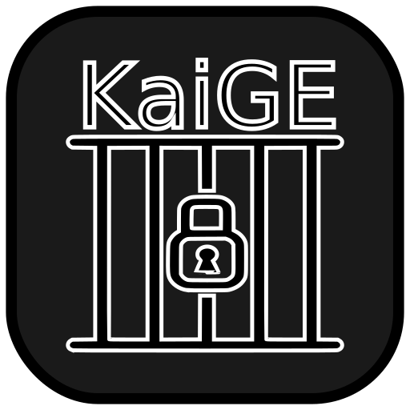

<!-- markdownlint-disable MD033 -->
# 
KaiGE

  

> [!WARNING]
> KaiGE is nowhere near a finished product and in it's current state, it doesn't function as a game engine. The site is not up yet, so links will <ins>NOT</ins> work.

KaiGE is a modern and versatile game engine written in Rust, designed to empower developers in creating high-performance and cross-platform games. With a focus on simplicity, flexibility, and performance, KaiGE aims to be the go-to choice for game developers who want to harness the power of Rust in their game development journey.

## Features

> [!NOTE]
> This Checklist shows what the engine currently contains

- [x] **Rust-Powered:** KaiGE takes full advantage of Rust's memory safety and performance, providing a robust foundation for game development.

- [x] **Entity-Component System (ECS):** Utilize the entity-component system for efficient and scalable game architecture, allowing you to build complex game entities with ease.

- [ ] **Cross-Platform:** KaiGE supports multiple platforms, including Windows, macOS, and Linux, ensuring your game can reach a wide audience.

- [ ] **Modern Graphics:** Harness the power of modern graphics APIs like Vulkan or OpenGL for stunning visuals and smooth rendering.

- [ ] **2D and 3D Support:** KaiGE provides support for both 2D and 3D game development, giving you the flexibility to create the game you envision.

- [ ] **Extensible:** The engine is designed to be extensible, allowing you to easily integrate third-party libraries and tools into your game development workflow.

- [ ] **Community Driven:** Despite KaiGE being open-source, KaiGE also hosts a list of community assets and plugins at [https://kaige.rs/assets](https://kaige.rs/assets).

- [ ] **Editor:** KaiGE has an extensible editor that takes heavy inspiration from [Godot](https://github.com/godotengine/godot).

## Getting Started

<del>
To get started with KaiGE, follow these steps:

1. **Install Rust:** Make sure you have Rust installed on your machine. You can install it by following the instructions on [https://www.rust-lang.org/](https://www.rust-lang.org/).

2. **Create a New Project:** Use the KaiGE template to start a new project. first install kaige-cli by `cargo install kaige-cli` and then run the command `kaige new [your-projects-name]`.

3. **Explore the Documentation:** Check out the official [documentation](https://kaige.rs/docs) for in-depth guides, tutorials, and API references to help you navigate through KaiGE's features. ~~
</del>

## Contributing

Contributions to KaiGE are welcome! Whether you want to report a bug, request a feature, or contribute code, check out our [Contribution Guidelines](CONTRIBUTING.md) to get started.

## License

KaiGE is licensed under the [GNU General Public License](LICENSE).
